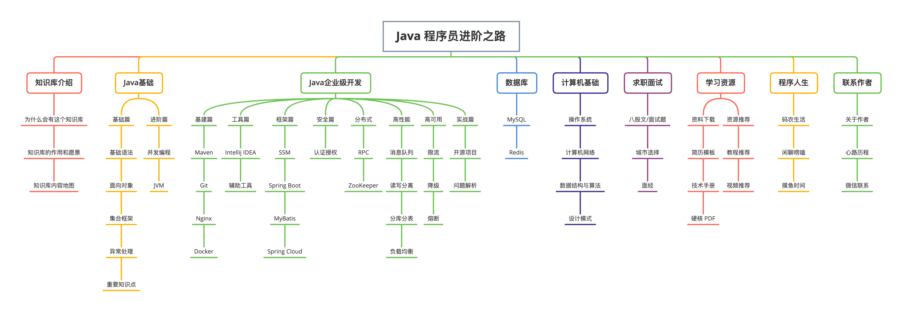
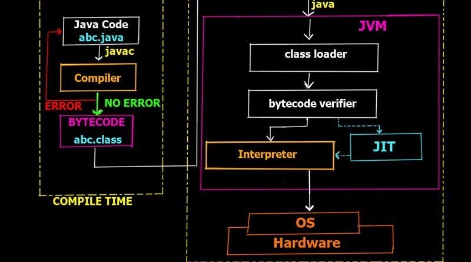

## JAVA

<a href="./img/Leanning_path.png">Learning path</a>

### JAVA岗位
* Android
    * 开发工程师 架构工程师 逆向工程师
* Web
    * 前端开发 网站后台开发工程师 高级后端开发工程师
* 系统开发
    * JAVA技术专家 系统架构师 后台开发
### JAVA程序执行过程
JAVA**源码**本质上是一个文本文件，需要用`javac`把`Hello.java`编译成**字节码**文件`Hello.class`

<a href="https://www.cnblogs.com/linj7/p/14122919.html">link</a>

## IntelliJ IDEA

## JAVA程序基础
JAVA是面向对象的语言，其基本结构为：修饰符-关键字-类名+方法：
~~~ java
public class Hello {
    public static void main(String[] args) {
        // 向屏幕输出文本:
        System.out.println("Hello, world!");
        /* 多行注释开始
        注释内容
        注释结束 */
    }
} // class定义结束
~~~
基本单位就是`class`， `class`是关键字。关键字后面接类名，其要求：
* 必须英文字母开头，后接字母，下划线
* 习惯大写开头
`public`是访问修饰符，表示该`class`是公开的。
`class`内部可以定义若干方法：
* 方法名为`main`，返回`void`的值
* 修饰符也能修饰方法，其中第二个修饰符`statics`表示静态方法。

## 变量和数据类型
有时类型的名字太长，就可以用`var`关键字，编译器可以通过赋值语句自动推断出类型：
> var sb = new StringBuilder();  
与
StringBuilder sb = new StringBuilder();
效果相同

## 四则运算
移位运算:
~~~ java
int n = 7;       // 00000000 00000000 00000000 00000111 = 7
int a = n << 1;  // 00000000 00000000 00000000 00001110 = 14
int b = n << 2;  // 00000000 00000000 00000000 00011100 = 28
int c = n << 28; // 01110000 00000000 00000000 00000000 = 1879048192
int d = n << 29; // 11100000 00000000 00000000 00000000 = -536870912
~~~
位运算：
~~~ java
AND = 0 & 0; //AND=0
OR = 0 | 1; //OR=1
NOT = ~0; //NOT=1
NOT_OR = 0 ^ 1 //NOT_OR=1
~~~
运算优先级：
优先级从高到低依次为：
* `()`
* `!` `~` `++` `--`
* `*` `/` `%`
* `+` `-`
* `<<` `>>` `>>>`
* `&`
* `|`
* `+=` `-=` `*=` `/=`

