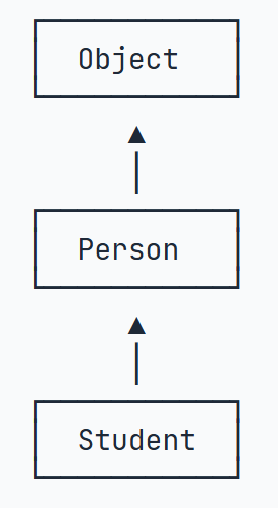

# JAVA

<a href="./img/Leanning_path.png">Learning path</a>

## JAVA岗位
* Android
    * 开发工程师 架构工程师 逆向工程师
* Web
    * 前端开发 网站后台开发工程师 高级后端开发工程师
* 系统开发
    * JAVA技术专家 系统架构师 后台开发
## JAVA程序执行过程
JAVA**源码**本质上是一个文本文件，需要用`javac`把`Hello.java`编译成**字节码**文件`Hello.class`

<a href="https://www.cnblogs.com/linj7/p/14122919.html">link</a>

## IntelliJ IDEA

## JAVA程序基础
JAVA是面向对象的语言，其基本结构为：修饰符-关键字-类名+方法：
~~~ java
public class Hello {
    public static void main(String[] args) {
        // 向屏幕输出文本:
        System.out.println("Hello, world!");
        /* 多行注释开始
        注释内容
        注释结束 */
    }
} // class定义结束
~~~
基本单位就是`class`， `class`是关键字。关键字后面接类名，其要求：
* 必须英文字母开头，后接字母，下划线
* 习惯大写开头
`public`是访问修饰符，表示该`class`是公开的。
`class`内部可以定义若干方法：
* 方法名为`main`，返回`void`的值
* 修饰符也能修饰方法，其中第二个修饰符`statics`表示静态方法。

### 变量和数据类型
有时类型的名字太长，就可以用`var`关键字，编译器可以通过赋值语句自动推断出类型：
> var sb = new StringBuilder();  
与
StringBuilder sb = new StringBuilder();
效果相同

### 四则运算
移位运算:
~~~ java
int n = 7;       // 00000000 00000000 00000000 00000111 = 7
int a = n << 1;  // 00000000 00000000 00000000 00001110 = 14
int b = n << 2;  // 00000000 00000000 00000000 00011100 = 28
int c = n << 28; // 01110000 00000000 00000000 00000000 = 1879048192
int d = n << 29; // 11100000 00000000 00000000 00000000 = -536870912
~~~
位运算：
~~~ java
AND = 0 & 0; //AND=0
OR = 0 | 1; //OR=1
NOT = ~0; //NOT=1
NOT_OR = 0 ^ 1 //NOT_OR=1
~~~
运算优先级：
优先级从高到低依次为：
* `()`
* `!` `~` `++` `--`
* `*` `/` `%`
* `+` `-`
* `<<` `>>` `>>>`
* `&`
* `|`
* `+=` `-=` `*=` `/=`

### 布尔运算
对于`boolean`类型,只有`true`和`false`两个值,包括以下运算关系:
* 比较运算符:`>`,`>=`,`<`,`<=`,`==`,`!=`
* 与运算:`&&`
* 或运算:`||`
* 非运算:`!`

>boolean isGreater = 5 > 3; // true
int age = 12;
boolean isZero = age == 0; // false
boolean isNonZero = !isZero; // true
boolean isAdult = age >= 18; // false
boolean isTeenager = age >6 && age <18; // true

Java还提供一个三元运算符`b ? x : y`，它根据第一个布尔表达式的结果，分别返回后续两个表达式之一的计算结果。
~~~ java
// 三元运算
public class Main {
    public static void main(String[] args) {
        int n = -100;
        int x = n >= 0 ? n : -n;
        System.out.println(x);
    }
}
~~~

### 字符与字符串
Java在内存中都是用的Unicode表示字符,所以一个中文字符就可以用一个`char`类型表示:
* `char c1 = '中'` `char c2 = \u4e2d'`.
* 字符`char`用单引号`'...'
* `字符串`string`用双引号`"..."`.  

Java的字符串也有不可变的性质,如果赋值为`null`则变量不指向任何对象
* `String`是引用类型,`==`比较的是引用是否相等,`equals`比较的是字符串内容是否相等.
~~~ java
// 条件判断
public class Main {
    public static void main(String[] args) {
        String s1 = "hello";
        String s2 = "HELLO".toLowerCase();
        System.out.println(s1);
        System.out.println(s2);
        if (s1.equals(s2)) {
            System.out.println("s1 equals s2");
        } else {
            System.out.println("s1 not equals s2");
        }
    }
}
~~~

### 数组
创建数组`int [] ns = new int[5]`;申明并赋值`int[] ns ={ 68, 79, 91, 85, 62 };`
~~~ java
// 数组
public class Main {
    public static void main(String[] args) {
        // 5位同学的成绩:
        int[] ns;
        ns = new int[] { 68, 79, 91, 85, 62 };
        System.out.println(ns.length); // 5
        ns = new int[] { 1, 2, 3 };
        System.out.println(ns.length); // 3
    }
}
~~~
可以使用for each语句遍历数组:
~~~ java
// 数组
public class Main {
    public static void main(String[] args) {
        // 5位同学的成绩:
        int[] ns = { 68, 79, 91, 85, 62 };
        for (int n : ns) {
            System.out.println(n);
        }
    }
}
~~~

### 浮点数
由于计算机的存储方式位二进制，浮点数会产生误差。如果要比浮点数的大小，可以比较两个浮点数之差的绝对值是否小于一个很小的数。
~~~ java
// 比较x和y是否相等，先计算其差的绝对值:
double r = Math.abs(x - y);
// 再判断绝对值是否足够小:
if (r < 0.00001) {
    // 可以认为相等
} else {
    // 不相等
}
~~~

## 流程控制

### 输出
`println`表示输出并换行。`print`只输出。格式化输出用`printf`。
~~~ java
public class Main {
    public static void main(String[] args) {
        int n = 1234;
        System.out.printf("n=%d, hrx=%08x\n",n, n);

        double y = 3.1415926;
        System.out.printf("y=%.3f", y);
    }
}
~~~

### 输入
`Scanner`类可以从控制台读取用户输入。`Scanner`类是Java提供的一个用于读取输入的类，可以从控制台、文件等输入源中读取数据。使用`Scanner`类可以方便地读取各种类型的数据，如整数、浮点数、字符串等。
~~~ java
import java.io.File;
import java.util.Scanner;

public class Main {
    public static void main(String[] args) {
        Scanner sc = new Scanner(System.in);
        System.out.println("Enter the name of the file: ");
        String fileName = sc.nextLine();
        System.out.println(fileName);
    }
}
~~~
首先通过`import`语句导入`java.util.Scanner`，然后，创建`Scanner对象`并传入`System.in`。  
`System.out`代表标准输出流，而`System.in`代表标准输入流。直接使用`System.in`读取用户输入虽然是可以的，但需要更复杂的代码，而通过`Scanner`就可以简化后续的代码。
有了`Scanner`对象后，要读取用户输入的字符串，使用`scanner.nextLine()`，要读取用户输入的整数，使用`scanner.nextInt()`。`Scanner`会自动转换数据类型，因此不必手动转换。

### switch case

~~~ java
// switch
public class Main {
    public static void main(String[] args) {
        String fruit = "apple";
        switch (fruit) {
        case "apple":
            System.out.println("Selected apple");
            break;
        case "pear":
            System.out.println("Selected pear");
            break;
        case "mango":
            System.out.println("Selected mango");
            break;
        default:
            System.out.println("No fruit selected");
            break;
        }
    }
}
~~~
在`switch`语句中，`case`语句具有“穿透性”，遇到`case`后的语句会顺序执行，直到遇到`break`语句或者`switch`语句结束。

***Java12***后,支持新语法,使用类似匹配模式的方法
~~~ java
// switch
public class Main {
    public static void main(String[] args) {
        String fruit = "apple";
        switch (fruit) {
        case "apple" -> System.out.println("Selected apple");
        case "pear" -> System.out.println("Selected pear");
        case "mango" -> {
            System.out.println("Selected mango");
            System.out.println("Good choice!");
        }
        default -> System.out.println("No fruit selected");
        }
    }
}
~~~
* 新的`swith`语法使用`->`符号，表示匹配成功后执行的语句。如果有多条语句，可以使用`{...}`。
* 新的`switch`语法不再需要`break`语句，匹配后自动跳出`switch`。
* 新的`switch`语法允许同时匹配多个值，用逗号`,`分割。

`yield`在`switch`语句中的作用是返回一个值，并结束`switch`语句。`yield`语句可以返回一个值，这个值的类型必须和`switch`表达式的类型一致。
~~~ java
// switch
public class Main {
    public static void main(String[] args) {
        String fruit = "orange";
        int opt = switch (fruit) {
            case "apple" -> 1;
            case "pear", "mango" -> 2;
            default -> {
                int code = fruit.hashCode();
                yield code; // 使用yield返回值
            }
        };
        System.out.println("opt = " + opt);
    }
}
~~~
### While循环

~~~ java
// while循环 
public class Main {
    public static void main(String[] args) {
        int n = 0;
        while (n < 10) {
            System.out.println(n);
            n++;
        }
    }
}
~~~
~~~ java
// do while循环
public class Main {
    public static void main(String[] args) {
        int n = 0;
        do {
            System.out.println(n);
            n++;
        } while (n < 10);
    }
}
~~~
### for循环
~~~ java
// for循环 
public class Main {
    public static void main(String[] args) {
        for (int i = 0; i < 10; i++) {
            if (i == 5) {
                break; // 提前结束循环
            }
            if (i % 2 == 0) {
                continue; // 跳过当前循环
            }
            System.out.println(i);
        }
    }
}
~~~

## 数组进阶
### 数组排序
冒泡排序
~~~ java
// 降序排序
import java.util.Arrays;

public class Main {
    public static void main(String[] args) {
        int[] ns = { 28, 12, 89, 73, 65, 18, 96, 50, 8, 36 };
        // 排序前:
        System.out.println(Arrays.toString(ns));
        // TODO:
        for (int i = 0; i < ns.length; i++) {
            for (int j = i + 1; j < ns.length; j++) {
                if (ns[i] == ns[j] || ns[i] > ns[j]) {continue;}
                else if (ns[i] < ns[j]) {int temp = ns[i]; ns[i] = ns[j]; ns[j] = temp;}
            }
        }
        // 排序后:
        System.out.println(Arrays.toString(ns));
        if (Arrays.toString(ns).equals("[96, 89, 73, 65, 50, 36, 28, 18, 12, 8]")) {
            System.out.println("测试成功");
        } else {
            System.out.println("测试失败");
        }
    }
}
~~~
## 面向对象编程
面向对象编程是Java的核心思想，Java是一个面向对象的编程语言。面向对象编程的基本概念包括：类、对象、封装、继承和多态。
* **类**：类是对象的模板或蓝图，定义了对象的属性和方法。
* **对象**：对象是类的实例，具有类定义的属性和方法。
* **封装**：封装是将数据和方法组合在一起，并隐藏实现细节的过程。通过访问修饰符（如`private`、`protected`和`public`）来控制对类成员的访问。
* **继承**：继承是一个类可以从另一个类派生出新的类的机制。子类可以继承父类的属性和方法，并可以重写父类的方法。
* **多态**：多态是指同一方法在不同对象上可以有不同的实现。Java通过方法重载和方法重写来实现多态。
* **抽象**：抽象是指将对象的共同特征提取出来，形成一个抽象类或接口。抽象类和接口不能被实例化，只能被继承或实现。
* **接口**：接口是一个特殊的抽象类，定义了一组方法，但不提供实现。类可以实现多个接口，从而实现多重继承。
* **构造函数**：构造函数是一个特殊的方法，用于初始化对象的属性。构造函数的名称与类名相同，并且没有返回值。
* **析构函数**：析构函数是一个特殊的方法，用于释放对象占用的资源。Java使用垃圾回收机制自动管理内存，因此不需要显式定义析构函数。
* **方法重载**：方法重载是指在同一个类中，可以定义多个同名的方法，但参数列表不同。Java通过参数的类型、数量和顺序来区分不同的方法。
* **方法重写**：方法重写是指子类可以重写父类的方法，以实现不同的功能。重写的方法必须具有相同的名称、参数列表和返回类型。

### 定义class
一个class可以定义多个`字段(field)`, 用来描述一个类的特征。
~~~ java
class Person {
    public String name;
    public int age;
}
~~~
上诉实例把`string`字段name和`int`字段age汇聚到一个对象上，实现了数据封装。`public`是用户来修饰字段的，用来表示可以外部访问。

### 创建class
`new`操作符可以创建一个实例，然后，需要定义一个引用类型的变量来指向这个实例
> Person ming = new Person();

`Person ming`是定义`Person`类型的变量`ming`，而`new Person()`是创建`Person`实例
有了这个指向实例的变量，我们就可以通过这个变量来操作实例，访问实例变量可以用`变量.字段`：

~~~ java
ming.name = "Xiao Ming"; // 对字段name赋值
ming.age = 12; // 对字段age赋值
System.out.println(ming.name); // 访问字段name

Person hong = new Person();
hong.name = "Xiao Hong";
hong.age = 15;
~~~

为了防止外部直接访问字段，我们可以把字段定义为`private`，这样就只能通过内部构建方法来访问了。
~~~ java
// private field
public class Main {
    public static void main(String[] args) {
        Person ming = new Person();
        ming.setName("Xiao Ming"); // 设置name
        ming.setAge(12); // 设置age
        System.out.println(ming.getName() + ", " + ming.getAge());
    }
}

class Person {
    private String name;
    private int age;

    public String getName() {
        return this.name;
    }

    public void setName(String name) {
        this.name = name;
    }

    public int getAge() {
        return this.age;
    }

    public void setAge(int age) {
        if (age < 0 || age > 100) {
            throw new IllegalArgumentException("invalid age value");
        }
        this.age = age;
    }
}
~~~

调用方法的语法是`实例对象.方法名(参数)`，方法名后面可以跟上参数列表。例如`ming.setName("Xiao Ming")`表示调用`ming`对象的`setName`方法，并传入参数`"Xiao Ming"`。
方法定义
>修饰符 方法返回类型 方法名(方法参数列表) {
    若干方法语句;
    return 方法返回值;
}

方法返回值可以是任意类型，包括基本数据类型和引用类型。如果方法没有返回值，则返回类型为`void`。方法参数列表可以为空，也可以包含多个参数，参数之间用逗号分隔。方法体包含若干语句，可以使用`return`语句返回一个值。

### 构造方法
创建实例时，是通过构造方法来初始化实例的。构造方法的名称与类名相同，并且没有返回值。构造方法可以有参数，也可以没有参数。
* 如果一个类没有定义构造方法，Java会自动提供一个默认的构造方法。
* 如果一个类定义了构造方法，Java不会提供默认的构造方法。
* 如果一个类定义了多个构造方法，Java会根据参数列表来选择合适的构造方法。
构造方法可以重载`Overload`，即可以定义多个构造方法，参数列表不同。
~~~ java
class Hello {
    public void hello() {
        System.out.println("Hello, world!");
    }

    public void hello(String name) {
        System.out.println("Hello, " + name + "!");
    }

    public void hello(String name, int age) {
        if (age < 18) {
            System.out.println("Hi, " + name + "!");
        } else {
            System.out.println("Hello, " + name + "!");
        }
    }
}
~~~
方法重载的目的是，功能类似的方法使用同一名字，更容易记住，因此，调用起来更简单。

### 继承

继承是一个类可以从另一个类派生出新的类的机制。子类可以继承父类的属性和方法，并可以重写父类的方法。Java使用`extends`关键字来表示继承关系。

~~~ java
class Person {
    private String name;
    private int age;

    public String getName() {...}
    public void setName(String name) {...}
    public int getAge() {...}
    public void setAge(int age) {...}
}

class Student extends Person {
    // 不要重复name和age字段/方法,
    // 只需要定义新增score字段/方法:
    private int score;

    public int getScore() { … }
    public void setScore(int score) { … }
}
~~~

Java只允许一个class继承自一个类，因此，一个类有且仅有一个父类。在Java中，没有明确写`extends`的类，编译器会自动加上`extends Object`。所以，任何类，除了Object，都会继承自某个类。

如果一个类继承了另一个类，那么它就可以访问父类的所有`public`和`protected`成员，包括字段和方法。子类不能访问父类的`private`成员。

~~~ java
class Person {
    protected String name;
    protected int age;
}

class Student extends Person {
    public String hello() {
        return "Hello, " + name; // OK!
    }
}
~~~

如果子类和父类有同名的字段，子类会隐藏父类的字段。要访问父类的字段，可以使用`super`关键字。

在继承关系中，子类如果定义了一个与父类方法签名完全相同的方法，被称为覆写(Override)
~~~ java
class Person {
    public void run() {
        System.out.println("Person.run");
    }
}
class Student extends Person {
    @Override
    public void run() {
        System.out.println("Student.run");
    }
}
~~~

### 多态

