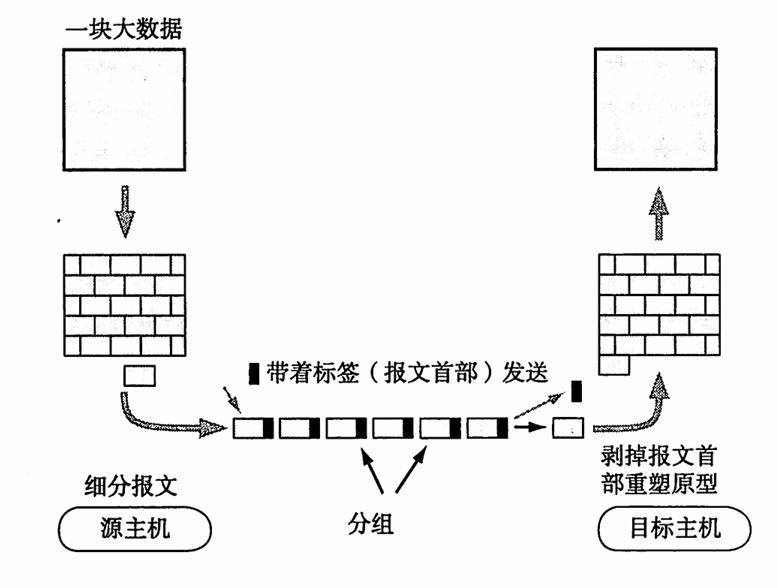

## ICP/IP

### 计网历史

* 1983年TCP/IP成为ARPANET上的标准协议，使所有TCP/IP协议的计算机都能利用互联网相互通信，因此称为“互联网元年”
* 1985年建成三级结构的互联网，分为主干网 地区网 校园网
* 1993年商业互联网占据主流，ISP(Internet Service Provider)出现

### 端口

* 21:FTP
* 25:SMTP服务
* 80:HTTP
* 53:DNS
* 23:telnet服务(remote services)

### ISP

### CDN

CDN边缘服务器主要目的是将内容存储在尽可能靠近发出请求的客户端计算机的位置，从而减少延迟并缩短页面加载时间。

## IXP

IXP(Internet exchange point) 是一个物理位置，ISP和CDN之类的互联网基础设施通过它相互连接。

## 协议

为了让不同设备之间进行通信，定义了协议。
在基本的TCP/IP网络体系中，协议有：
* IP
* ICMP(Internet Control Message Protocol)
* TCP
* UDP
* HTTP
* TELNET
* SNMP
* SMTP

在数据的传输过程中，常用分组交换协议。分组交换协议指的就是将大数据分割成一个个包(Packet), 以较小的单位进行传输。

## OSI(Open System Interconnetction)模型

OSI模型按照结构分为七层, 每个分层都接受它下一层提供的特殊服务，并且负责为自己的上一层提供特定的服务。分层有利于模块化开发，每层都能够独立使用。
* 物理层(Physical Layer)
    * 激活、维持、关闭通信端点之间的机械特性、电子特性、功能特性以及过程特性。
    * 该层为上层协议提供了一个传输数据的可靠物理媒体。（中继器 集线器）

* 数据链路层(Data Link Layer)
    * 数据链路层在物理层提供的服务的基础上向网络层提供服务，其最基本的服务是将源自网络层来的数据可靠地传输到相邻节点的目标机网络层。
    * 为达到这一目的，数据链路必须具备一系列相应的功能，主要有：如何将数据组合成数据块，在数据链路层中称这种数据块为帧（frame），帧是数据链路层的传送单位；
    * 如何控制帧在物理信道上的传输，包括如何处理传输差错，如何调节发送速率以使与接收方相匹配；以及在两个网络实体之间提供数据链路通路的建立、维持和释放的管理。数据链路层在不可靠的物理介质上提供可靠的传输。该层的作用包括：物理地址寻址、数据的成帧、流量控制、数据的检错、重发等。
    * 有关数据链路层的重要知识点：
        1. 数据链路层为网络层提供可靠的数据传输
        1. 基本的数据单位为帧(frame)
        1. 主要的协议：以太网协议
        1. 重要的设备：网桥和交换机

* 网络层(Network Layer)
    * 路径选择、路由及其逻辑寻址
    * 基本数据单位为IP数据包
    * 包含的协议：
        1. IP协议(Internet Protocol)
        1. ICMP协议(Internet Control Message Protocol, 因特网控制报文协议)
        1. ARP(Address Resolution Protocol, 地址解析协议)
        1. RARP协议(Reverse Address Resolution Protocol, 逆地址解析协议)
    * 重要的设备: 路由器

* 传输层(Transport Layer)
    * 传输层负责将上层数据分段并提供端到端的、可靠的或不可靠的传输以及端到端的差错控制和流量控制问题；
    * 包含的主要协议：TCP协议（Transmission Control Protocol，传输控制协议）、UDP协议（User Datagram Protocol，用户数据报协议）
    * 重要设备：网关

* 会话层(Session Layer)
    * 管理主机之间的会话进程，负责建立，管理，终止进程之间的会话
    * 插入校验点来实现数据同步

* 表示层(Presentation Layer)
    * 对上层数据或信息进行变换以保证主机应用层可以被另一个主机的应用程序理解。

* 应用层(Application Layer)
    * 为操作系统或网络应用程序提供网络服务的接口

